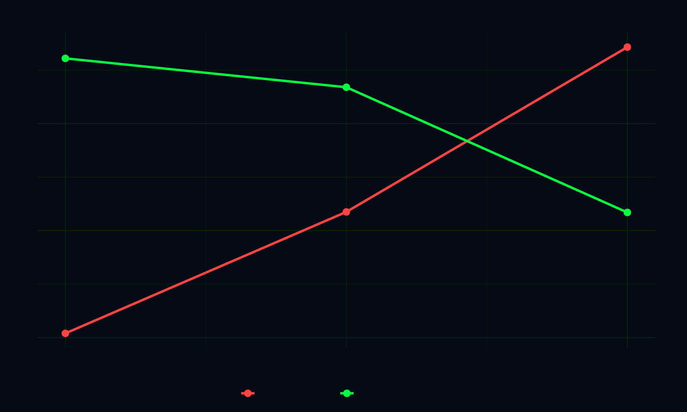

# AI2HTML Integration Guide

## Overview

This guide explains how to export your Adobe Illustrator charts (.ai files) as responsive ai2html and integrate them into the scrollytelling template.

## Files

**Main files:**
- `index-ai2html.html` — Scrollytelling template with Scrollama (responsive ai2html layout)
- `styles-ai2html.css` — Dark terminal aesthetic + ai2html responsive styling
- `script-ai2html.js` — Scrollama interactions + fade-in animations

**To use:** Rename these to `index.html`, `styles.css`, and `script.js` when ready, or keep separate during development.

---

## Step 1: Export Charts as AI2HTML

### Prerequisites
- Adobe Illustrator (CC 2019 or later recommended)
- [ai2html script](https://github.com/google/ai2html) installed in Illustrator scripts folder

### For Each Chart:

1. **Open the .ai file** (e.g., `chart_01_divergence.ai`)

2. **Run ai2html**:
   - File → Scripts → ai2html
   - Configure settings:
     - **Format**: SVG + PNG (for responsiveness)
     - **Artboards**: Export all
     - **CSS**: Inline (simpler integration)
   - Export to same folder as HTML

3. **ai2html outputs**:
   - `chart_01_divergence.html` (contains SVG + CSS + PNG fallback)
   - `chart_01_divergence-Artboard_1.png` (PNG fallback)
   - etc.

### Charts to Export

| File | Purpose |
|------|---------|
| `chart_01_divergence.ai` | Cost vs Effectiveness line chart (2022-2024) |
| `chart_02_composition.ai` | Spending allocation: Evidence/Waste/NoEvidence |
| `sunburst_chart.ai` | Hierarchical spending breakdown |

---

## Step 2: Extract AI2HTML Content

After ai2html export, you'll have HTML like:

```html
<!-- Generated by ai2html -->
<div id="g-chart01-box" class="ai2html">
    <div id="g-chart01-Artboard_1" class="g-artboard" style="width:780px; height:490px;" data-min-width="780">
        
        <!-- SVG content here -->
        <svg class="g-aiImg" ...>
        ...
        </svg>
    </div>
</div>
```

**Extract the `<style>` tags and SVG `<div>` content** (everything from `<!-- Generated by ai2html -->` to the closing `</div>`)

---

## Step 3: Replace Placeholders in index-ai2html.html

### For Each Chart:

Find the comment:
```html
<!-- INSERT chart_XX ai2html HERE -->
```

Replace with the extracted ai2html content from Step 2.

#### Example: Divergence Chart

**BEFORE:**
```html
<div id="scrolly-divergence" class="scrolly-container section-block">
    <div class="sticky-thing">
        <div class="chart-annotation">...</div>

        <!-- INSERT chart_01_divergence ai2html HERE -->
        <div id="g-chart01-box" class="ai2html">
            <div id="g-chart01-default" class="g-artboard" style="width:900px; height:550px;" data-min-width="900">
                
            </div>
        </div>

        <div class="chart-caption">...</div>
    </div>
    ...
</div>
```

**AFTER:**
```html
<div id="scrolly-divergence" class="scrolly-container section-block">
    <div class="sticky-thing">
        <div class="chart-annotation">...</div>

        <!-- [PASTE FULL ai2html OUTPUT HERE] -->
        <style media="screen,print">
            #g-chart01-box, ...
        </style>
        <div id="g-chart01-box" class="ai2html">
            <div id="g-chart01-Artboard_1" class="g-artboard" ...>
                
                <svg class="g-aiImg" ...>
                    <!-- Full SVG paths and content -->
                </svg>
            </div>
        </div>

        <div class="chart-caption">...</div>
    </div>
    ...
</div>
```

---

## Step 4: Adjust Artboard Sizing

AI2HTML exports may have fixed widths. Adjust for responsiveness:

**In the `<style>` section for each chart:**

```css
#g-chart01-box {
    max-width: 900px;
    margin: 0 auto;
    width: 100%;
}

#g-chart01-Artboard_1 {
    width: 100% !important;  /* Override inline style */
    height: auto !important;
}
```

Already included in `styles-ai2html.css`, but verify per chart.

---

## Step 5: Test Responsiveness

1. **Desktop**: Charts should scale smoothly
2. **Tablet (768px)**: Charts responsive, step text readable
3. **Mobile (480px)**: Charts stack, text remains legible

CSS breakpoints in `styles-ai2html.css` handle automatic scaling.

---

## Scrollama Step Interactions

Each chart section has 3 scroll steps with narrative text:

```html
<div class="chart-steps">
    <div class="step" data-step="1">
        <p>Step 1 text...</p>
    </div>
    <div class="step" data-step="2">
        <p>Step 2 text...</p>
    </div>
    <div class="step" data-step="3">
        <p>Step 3 text...</p>
    </div>
</div>
```

When user scrolls through steps, `handleChartStep()` in `script-ai2html.js` is called to:
- Highlight step text (opacity changes)
- Optionally update chart styling (brightness, saturation)

---

## Important Notes

### Font Consistency
- AI files use Helvetica (no longer Courier New)
- ai2html preserves fonts in SVG
- Illustrator font substitution rules are in `fonts-mapping.xml`

### Image Fallbacks
- ai2html exports PNG fallbacks for older browsers
- Modern browsers use inline SVG (better performance)

### Dark Aesthetic
- `styles-ai2html.css` wraps charts in dark terminal styling
- Chart colors from Illustrator are preserved
- Scanlines overlay stays fixed at z-index: 200

### Interactivity
- Native Illustrator interactivity (hover states, button triggers) works in ai2html
- Scrollama controls which artboard/state is visible
- Use data attributes to trigger chart states

---

## Troubleshooting

### Charts not displaying
- Check that PNG fallback files are in same directory
- Verify SVG IDs don't conflict (rename if needed)
- Check browser console for errors

### Responsive sizing broken
- Ensure `data-min-width` attributes are present
- Check that CSS `!important` flags aren't overridden
- Test in DevTools device emulation

### Fonts look wrong
- Use Illustrator → Type → Find/Replace Fonts
- Substitute Courier → Helvetica
- Re-export from Illustrator

### Dark background not showing
- Verify `--bg: #050a14` is set in `:root`
- Check z-index conflicts (scanlines should be z-index: 200)
- Ensure `#scanlines` div is in page

---

## Deployment

1. **Rename files**:
   ```bash
   mv index-ai2html.html index.html
   mv styles-ai2html.css styles.css
   mv script-ai2html.js script.js
   ```

2. **Include image files**:
   - All `*.png` fallback files from ai2html export
   - Folder structure: same directory as HTML

3. **Test**:
   ```bash
   python3 -m http.server 8000
   # Visit http://localhost:8000
   ```

4. **Check**:
   - Scroll through all sections
   - Verify charts appear at correct scroll positions
   - Test responsive breakpoints
   - Check dark aesthetic consistency

---

## Architecture Comparison

| Aspect | Old (SVG) | New (ai2html) |
|--------|-----------|---------------|
| **Charts** | Hand-coded SVG | Illustrator → ai2html |
| **Responsiveness** | Manual viewBox scaling | Automatic via CSS |
| **Interactivity** | Limited (JS-only) | Native Illustrator |
| **Scroll** | IntersectionObserver | Scrollama steps |
| **Performance** | Lightweight | PNG fallback for older browsers |
| **Editing** | Code-based | Illustrator visual editor |

---

## Resources

- [ai2html GitHub](https://github.com/google/ai2html)
- [ai2html documentation](https://ai2html.org/)
- [Scrollama documentation](https://github.com/russellgoldenberg/scrollama)
- [Adobe Illustrator scripting](https://github.com/Adobe-CEP/CEP-Resources)

---

## Questions?

Refer to:
1. `charts-data.json` — Chart data structure + metadata
2. `FONTS.txt` — Font substitution guide
3. `fonts-mapping.xml` — Detailed font rules
